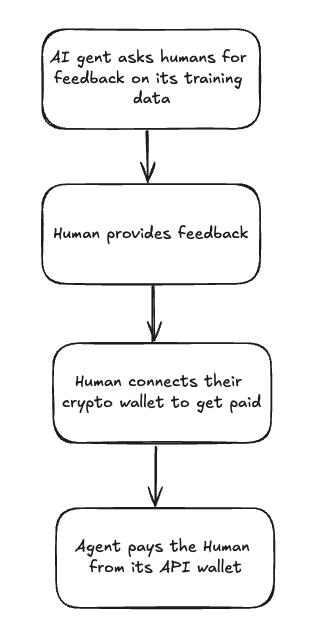

# Coinbase-SDK Next.js Example - AI Feedback Tool 
We created a simple AI feedback tool that uses the [Coinbase SDK](https://docs.cdp.coinbase.com/coinbase-sdk/docs/welcome) to create an [MPC wallet](https://docs.cdp.coinbase.com/mpc-wallet/docs/welcome), fund the wallet, and transfer eth on Base-Sepolia network to a recipient.



## Getting Started
To start, [create a CDP API Key](https://portal.cdp.coinbase.com/access/api). Then, create a `.env` file in the root directory with the following content:

```text
NAME="YOUR_API_KEY_NAME"
PRIVATE_KEY="YOUR_API_KEY_PRIVATE"
WALLET_ID="YOUR_WALLET_ID"
WALLET_DATA={ "WALLET_ID": { "seed": "", "encrypted": false, "authTag": "", "iv": "" } }
```

`WALLET_DATA` and `WALLET_ID` are optional. If you don't have a wallet, you can remove the `WALLET_ID` and `WALLET_DATA` fields. 
If you have a wallet, make sure the wallet you are using is funded before running the application.

Install the dependencies:
```bash
npm install
# or
yarn
```

Then, run the development server:
```bash
npm run dev
# or
yarn dev
```

Open [http://localhost:3000](http://localhost:3000) with your browser to use the application.

## Learn More
To learn more about the Coinbase SDK, take a look at the following resources:

- [Coinbase CDP](https://portal.cdp.coinbase.com/access/api) - Coinbase Developer Portal.
- [Platform APIs Documentation](https://docs.cdp.coinbase.com/coinbase-sdk/docs/quickstart) - Coinbase SDK Documentation.

## Deploy on Vercel

The easiest way to deploy this app is to use the [Vercel Platform](https://vercel.com/new?utm_medium=default-template&filter=next.js&utm_source=create-next-app&utm_campaign=create-next-app-readme) from the creators of Next.js.

Check out [Next.js deployment documentation](https://nextjs.org/docs/deployment) for more details.

## References

The images in the demo are sourced from [Unsplash](https://unsplash.com/).